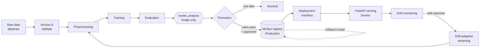

# MLOps-CI-Pipeline

A lightweight, local-first, drift-aware MLOps pipeline for supervised machine
learning. The project demonstrates how data handling, training, evaluation,
promotion governance, model registry integration, rollback, serving, monitoring,
and drift-adaptive retraining/fine-tuning can be connected into a traceable
lifecycle. It is designed for bachelor-level research, small teams, and
reproducible local experimentation rather than production-scale deployment.

It is meant for students, reviewers, and engineers who want to see the _process
around the model_ — versioning, governance, serving, and monitoring — expressed
as a single, configurable, end-to-end pipeline.

## Highlights

- **Dataset versioning** — tabular datasets are versioned using a SHA-256 hash
  of the raw CSV. Image datasets use a deterministic directory fingerprint based
  on relative file paths and file sizes; this supports repeatable local runs but
  is weaker than full byte-level image hashing.
- **Operational reproducibility** — each run is anchored by a pipeline execution
  ID, configuration hash, dataset version ID, and random seed. These anchors
  support repeatability within a controlled environment, but bit-identical
  results across hardware, dependency versions, or CPU/GPU paths are not
  guaranteed.
- **Two-layer data validation** — structural checks plus a data contract
  (dtypes, null fractions, label set, row counts) before any training runs.
- **MLflow as system of record** — experiment tracking and a model registry
  with `Production`/`Archived` stages and hard-validated lineage tags.
- **Governed promotion** — declarative YAML rules gate promotion, followed by a
  human-in-the-loop approval gate; a failed rule is a distinct `blocked`
  outcome, not a crash.
- **Auditable rollback** — a dedicated CLI restores a previous model version
  with a pre-intent record and a post-change governance audit.
- **Drift monitoring and governed adaptation** — tabular drift uses
  feature-level statistical tests through Evidently. Image drift combines
  per-channel Wasserstein distance, CNN-embedding MMD, and multi-scale
  diagnostics. Raw-DNG workflows can attach ISP scenario evidence, helping
  distinguish model degradation from camera or preprocessing changes.
- **Containerised serving + CI** — a FastAPI prediction service packaged as a
  Docker image, and a GitHub Actions workflow that exercises the pipeline.

## Overview

Training a model is the easy part of machine learning. The hard part is
everything _around_ the model: knowing exactly which data a model was trained
on, deciding objectively whether a new model is good enough to replace the
current one, keeping an audit trail of those decisions, serving the approved
model reliably, and noticing when incoming production data has drifted away from
the training data.

This project implements that surrounding lifecycle as a single, configurable
pipeline. The guiding idea is that the process around the model matters as much
as the model itself: every run is reproducible, every promotion is recorded, and
every served model has a traceable lineage.

### Supported task types

The pipeline operationalises three task types through a single entry point. The
task type is declared in the pipeline config (`task_type:`) and drives dispatch
throughout:

| `task_type`                | Data                      | Model                                                         |
| -------------------------- | ------------------------- | ------------------------------------------------------------- |
| `classification`           | Tabular CSV               | scikit-learn (Random Forest, Logistic Regression)             |
| `regression`               | Tabular CSV               | scikit-learn (Histogram Gradient Boosting, Linear Regression) |
| `image_classification_cnn` | JPG/PNG or raw DNG images | PyTorch CNN                                                   |

Raw DNG images are first processed through a deterministic seven-stage Image
Signal Processing (ISP) pipeline; standard JPG/PNG images skip that step. Both
image variants share the same CNN trainer.

## Architecture and pipeline flow

A single `run-pipeline` invocation runs four unconditional data-preparation
steps followed by a sequence of configurable stages. Each stage reads its inputs
from disk and writes its outputs to disk, so the orchestrator holds no large
in-memory state and any stage can be reasoned about in isolation.



The data-preparation steps (`detect dataset.yaml → version → validate → split`)
always run; the configurable stages are listed in each pipeline config under
`pipeline_stages`:

| Stage            | Pipelines  | Description                                                                                                       |
| ---------------- | ---------- | ----------------------------------------------------------------------------------------------------------------- |
| `preprocessing`  | all        | Selects features, normalises, writes `preprocessed/` (CSV or NPZ) and a `feature_map.json` contract.              |
| `training`       | all        | Trains the model defined in `training_*.yaml`; saves the artifact and logs to MLflow.                             |
| `evaluation`     | all        | Computes metrics. Classification: accuracy, F1, precision, recall. Regression: MAE, MSE, RMSE, R².                |
| `model_analysis` | image only | Offline pre-deployment stress test (ISP sensitivity for raw images, augmentation robustness for standard images). |
| `promotion`      | all        | Applies the promotion rules; if they pass, requests interactive approval and promotes the model to Production.    |
| `deployment`     | all        | Emits `outputs/deployment_manifest.json` describing the deployable state. Does **not** start containers.          |

`model_analysis` is **offline pre-deployment analysis**, not drift detection.
Drift detection — comparing the training reference against new production data
over time — runs separately via the monitoring CLIs after real batches arrive.

See [docs/architecture.md](docs/architecture.md) for the layered design.

## Repository structure

```
MLOps-CI-Pipeline/
├── .github/workflows/ci-pipeline.yml   GitHub Actions CI workflow (manual dispatch)
├── docker/                             Dockerfile + docker-compose for the API
├── docs/                               Architecture, deployment, drift, dataset docs
├── src/                                Python package (installed via pip -e .)
│   ├── common/                         Shared helpers (atomic I/O, torch device resolver)
│   ├── config/                         YAML configs + frozen dataclasses + validation
│   ├── data/                           Ingestion, versioning, validation, splitting,
│   │                                   preprocessing, ISP pipeline, drift adaptation
│   ├── drift/                          Drift computation and interpretation primitives
│   ├── evaluation/                     Metric computation and robustness analysis
│   ├── lifecycle/                      Model lifecycle states and transitions
│   ├── promotion/                      Promotion rule engine, comparator, approval gate
│   ├── registry/                       MLflow registry integration and rollback CLI
│   ├── training/                       Per-task trainers (classification/regression/CNN)
│   ├── pipeline/                       Orchestrator, stage registry, MLflow logging
│   ├── deployment/                     FastAPI prediction service
│   └── monitoring/                     Drift-monitoring CLIs and history index
├── data/raw/<dataset>/                 Immutable input datasets + dataset.yaml
├── data/processed/<dataset>/<id>/      Content-addressed versioned snapshots + splits
├── artifacts/runs/<id>/model/          Local trained-model artifact cache
├── mlruns/                             MLflow file-based tracking store
├── outputs/                            Run reports, evaluation/promotion decisions
├── tests/                              Pytest test suite
└── pyproject.toml                      Package, dependencies, and CLI entry points
```

## Installation

Python **3.12.x** is required (`requires-python = ">=3.12,<3.13"`). Other
versions are not supported.

### 1. Create a virtual environment

**macOS / Linux**

```bash
python3.12 -m venv .venv
source .venv/bin/activate
```

**Windows**

```bash
py -3.12 -m venv .venv
.\.venv\Scripts\Activate
```

### 2. Install the project in editable mode

```bash
pip install --upgrade pip
pip install -e .
```

This installs the package and registers all CLI commands listed below. On
Windows machines with an AMD/Intel GPU, `pip install -e ".[directml]"`
additionally enables DirectML acceleration; this extra is optional and not
supported on Linux. No external services are required for the default setup —
MLflow uses a local file-based store at `mlruns/`.

### CLI commands

`pip install -e .` puts the following commands on `PATH` (see
[pyproject.toml](pyproject.toml)):

| Command                                                     | Purpose                                                   |
| ----------------------------------------------------------- | --------------------------------------------------------- |
| `run-pipeline`                                              | Run the full pipeline from a config file.                 |
| `run-api`                                                   | Start the FastAPI prediction service.                     |
| `rollback-model`                                            | Restore a previous model version in the registry.         |
| `monitor-drift` / `monitor-drift-image`                     | Detect drift on a new tabular / image batch.              |
| `monitor-summary`                                           | Summarise stored drift-monitoring history over time.      |
| `prepare-image-batch`                                       | Preprocess incoming images into a drift-monitoring batch. |
| `prepare-drift-training` / `prepare-drift-training-tabular` | Stage a labeled drifted batch for retraining.             |
| `rollback-drift-training`                                   | Undo a drift-training staging operation.                  |

## Quickstart

### Run the pipeline

`run-pipeline` runs the whole pipeline; all data preparation is automatic.

```bash
# Tabular regression — Gradient Boosting on California Housing
run-pipeline --config src/config/pipeline_tabular_regression.yaml

# Tabular classification — Random Forest on Breast Cancer Wisconsin
run-pipeline --config src/config/pipeline_tabular_classification.yaml

# Image classification — PyTorch CNN on JPG/PNG images
run-pipeline --config src/config/pipeline_image_cnn.yaml

# CIFAR-10 in ImageFolder PNG layout
run-pipeline --config src/config/pipeline_cifar10.yaml

# Raw DNG images through the ISP pipeline → CNN
run-pipeline --config src/config/pipeline_image_raw.yaml
```

> **First run with a new dataset:** if `dataset.yaml` is missing, the pipeline
> prompts interactively for the target column and task type. This happens once.

The promotion stage needs an interactive terminal for its approval gate. In a
headless environment the gate cancels gracefully and no model is promoted.

### Run the tests

```bash
python -m pytest tests/ -v --tb=short
```

### Launch the API

`run-api` starts the FastAPI prediction service. Host and port come from
[src/config/deployment.yaml](src/config/deployment.yaml). At least one model
must already be promoted to Production.

```bash
run-api
```

It loads every model at the allowed stage (default `Production`) from the MLflow
registry at startup and exposes:

- `GET /` — a static HTML UI with a prediction form
- `GET /health` — liveness check (200 when ≥1 model is loaded, 503 otherwise)
- `GET /models` — lists loaded models and their task types
- `POST /predict/{model_name}` — single-sample prediction for the named model
- `POST /admin/reload` — reloads models from the registry without a restart

### Run with Docker Compose

The model is **not** baked into the image — it is loaded at runtime from the
volume-mounted MLflow store.

```bash
# Prerequisite: a Production model must exist (run the pipeline and approve)
run-pipeline --config src/config/pipeline_tabular_classification.yaml

# Copy the environment template and adjust if needed
cp .env.example .env

# Build and start
docker compose -f docker/docker-compose.yml up --build

# Verify, then stop
curl http://localhost:8000/health
docker compose -f docker/docker-compose.yml down
```

See [docs/deployment.md](docs/deployment.md) for the full environment-variable
reference and [.env.example](.env.example) for the template.

## Configuration

All configuration lives in [src/config/](src/config/) as YAML files. A run is
selected by passing one **pipeline config** to `run-pipeline --config`:

| Pipeline config                                     | Task                                             |
| --------------------------------------------------- | ------------------------------------------------ |
| `pipeline_tabular_classification.yaml`              | Tabular classification (also `*_ci.yaml` for CI) |
| `pipeline_tabular_regression.yaml`                  | Tabular regression                               |
| `pipeline_image_cnn.yaml` / `pipeline_cifar10.yaml` | Standard-image CNN classification                |
| `pipeline_image_raw.yaml` / `pipeline_fivek.yaml`   | Raw-image (ISP → CNN) classification             |

Each pipeline config references task-specific sub-configs under its `configs:`
block — `preprocessing`, `training`, `evaluation`, `deployment`, `promotion`,
and `drift` — plus `task_type`, `random_seed`, and the ordered
`pipeline_stages`. Configs are loaded into frozen dataclasses and fail-fast
validated by the loaders in [src/config/](src/config/).

Configuration is part of reproducibility: the config contributes to the hash
that anchors each run, so changing a YAML file produces a distinct, traceable
run rather than silently altering an existing one.

## Datasets

The tabular datasets (Breast Cancer Wisconsin, California Housing, Iris, Wine)
ship with the repository as small CSV files under [data/raw/](data/raw/). The
image datasets are **not** tracked in git — their files are too large — so they
must be downloaded separately to replicate the image runs:

| Dataset         | Pipeline config         | Download                                      |
| --------------- | ----------------------- | --------------------------------------------- |
| CIFAR-10        | `pipeline_cifar10.yaml` | <https://www.cs.toronto.edu/~kriz/cifar.html> |
| MIT-Adobe FiveK | `pipeline_fivek.yaml`   | <https://data.csail.mit.edu/graphics/fivek/>  |

After downloading, arrange the files into the per-class `images/` layout the
pipeline expects — see [data/raw/README.md](data/raw/README.md) for the exact
folder structure and step-by-step instructions.

## Model governance and promotion

**Promotion** happens inside the `promotion` stage of `run-pipeline`:

1. The promotion rule engine checks the candidate's metrics against the
   thresholds in [src/config/promotion.yaml](src/config/promotion.yaml). The
   default gates are accuracy ≥ 0.80 and weighted F1 ≥ 0.75 (classification),
   and R² ≥ 0.80 and MAE ≤ 0.40 (regression).
2. If a rule fails, the run ends with a distinct `blocked` outcome and exit
   code 2.
3. If the rules pass, the interactive approval gate shows the metrics, the
   comparison against the current Production model, and live drift context, and
   asks for an approve / reject / cancel decision (a rejection requires a
   written reason).
4. On approval, the model is registered and transitioned to `Production` in the
   MLflow registry; the previous version is archived, and lineage tags are
   written.

By default the gates are checked against the **validation** split. The
`promotion_evaluation_split` key in `promotion.yaml` can switch this to `test`
or `both` once a populated test split exists.

**Rollback** restores a previous version with `rollback-model`:

```bash
# Interactive — lists versions and prompts for a target and a reason
rollback-model --config src/config/pipeline_tabular_classification.yaml

# Non-interactive
rollback-model --config src/config/pipeline_tabular_classification.yaml \
    --version 2 --reason "accuracy regression" --yes
```

Rollback writes a pre-change intent record _before_ changing the registry, then
writes a governance audit afterwards, so the action stays traceable even if it
is interrupted.

## Drift monitoring and retraining

Once a model is in production you collect new production data and check whether
it has drifted away from the training reference. Drift detection is run manually
via the monitoring CLIs; it is intentionally separate from training so training
provenance stays immutable.

### Tabular drift

```bash
monitor-drift \
    --batch-csv data/new_batch.csv \
    --model-name lightweight-mlops-pipeline-classification \
    --config src/config/pipeline_tabular_classification.yaml
```

Results are saved as JSON under `outputs/drift_monitoring/<model-name>/`. If
drift severity meets the configured threshold, you are prompted to choose a
response action. Use `monitor-summary` to review the accumulated history.

### Image drift

1. Place new images in a folder (flat or class subfolders both work).
2. Preprocess them into a batch file with the same resize/normalisation as
   training: `prepare-image-batch --input-dir <dir> --config <pipeline-config>`
   (it prints the exact `monitor-drift-image` command to run next).
3. Run `monitor-drift-image --batch-npz data/batches/<timestamp>.npz --config <config>`.

For raw-image pipelines, pass `--drift-scenarios-dir` and `--sensitivity-report`
to attach a plausible physical explanation of the observed drift.

### Drift-adaptive retraining

When drift is significant, two workflows turn it back into an improved model:

- **Image pipelines:** `prepare-drift-training` splits a labeled drifted image
  batch into a training portion (added to the raw dataset) and a held-out
  evaluation set with a Production-model baseline. Then `run-pipeline
--fine-tune` continues training from the Production weights.
- **Tabular pipelines:** `prepare-drift-training-tabular` splits a labeled
  drifted CSV similarly. Then `run-pipeline` retrains from scratch on the
  merged data.

In both cases the pipeline re-evaluates the new model on the same held-out
drifted data and shows a before/after comparison at the approval gate.
`rollback-drift-training` undoes a staging operation if you change your mind.

See [docs/drift-detection.md](docs/drift-detection.md) for the full workflow.

## Deployment

The `deployment` stage emits `outputs/deployment_manifest.json` describing the
deployable state (registry coordinates and readiness). It is **manifest-only**:
it does not start containers, push images, or perform a live rollout.

Serving is handled by the FastAPI service, either directly via `run-api` or as a
Docker container via [docker/docker-compose.yml](docker/docker-compose.yml). The
container mounts `mlruns/`, `src/config/`, and `artifacts/` read-only, so a
model can be re-promoted on the host and picked up by `POST /admin/reload`
without rebuilding the image.

## CI/CD

CI is defined in
[.github/workflows/ci-pipeline.yml](.github/workflows/ci-pipeline.yml) and is
**triggered manually** (`workflow_dispatch`) — it does not run on push or PR.
On a run it:

1. installs the package on Python 3.12;
2. runs the full test suite;
3. runs the pipeline against
   [src/config/pipeline_tabular_classification_ci.yaml](src/config/pipeline_tabular_classification_ci.yaml),
   a CI-specific config that omits the manual `promotion` stage;
4. uploads `outputs/`, `artifacts/runs/`, and `mlruns/` as build artifacts (even
   on failure);
5. builds the Docker image and verifies that the container imports cleanly.

The workflow validates plumbing, not deployments. Models trained in CI are
**not** promotable: the runner filesystem (and its `mlruns/`) is ephemeral, and
no `ModelVersion` is registered without the promotion stage. There is no linting
or type checking in CI.

## Testing

The pytest suite lives in [tests/](tests/), mirroring the `src/` package layout
(config, data, deployment, drift, evaluation, monitoring, pipeline, promotion,
registry, training).

```bash
python -m pytest tests/ -v --tb=short
```

Some image / ISP / PyTorch tests require `torch` to be installed in the
environment; without it those tests are skipped or fail as an environmental
limitation rather than a regression.

## MLflow

MLflow is the system of record for runs, metrics, artifacts, lineage tags, and
the model registry. By default it uses a local file-based store at `mlruns/`.
Browse it with:

```bash
mlflow ui --backend-store-uri mlruns
```

Then open `http://localhost:5000`. To use a remote tracking server, set
`MLFLOW_TRACKING_URI` or `mlflow.tracking_uri` in the pipeline config.

## Generated outputs

A run produces (paths relative to the repository root):

| Path                                     | Contents                                                                       |
| ---------------------------------------- | ------------------------------------------------------------------------------ |
| `data/processed/<dataset>/<version_id>/` | Versioned dataset snapshot, splits, and `preprocessed/` outputs.               |
| `artifacts/runs/<version_id>/model/`     | The trained model artifact (`model.joblib` or `model.pt`) and `metadata.json`. |
| `outputs/run_report.json`                | Per-stage status, timing, and overall pipeline outcome.                        |
| `outputs/evaluation_report.json`         | Metrics and the comparison against the Production model.                       |
| `outputs/promotion_decision.json`        | The recorded approve/reject decision and its rationale.                        |
| `outputs/deployment_manifest.json`       | The deployable state: registry coordinates and readiness.                      |
| `outputs/drift_monitoring/<model-name>/` | Drift snapshots plus a `history.jsonl` index.                                  |
| `mlruns/`                                | The MLflow tracking store (runs, metrics, artifacts, registry).                |

Most of these directories are generated and excluded from version control via
`.gitignore`; only per-dataset metadata under `data/raw/` is tracked.

## Documentation

| Document                                           | Topic                                                  |
| -------------------------------------------------- | ------------------------------------------------------ |
| [docs/architecture.md](docs/architecture.md)       | Layered architecture and stage-registry orchestration. |
| [docs/deployment.md](docs/deployment.md)           | Serving, Docker, and environment variables.            |
| [docs/drift-detection.md](docs/drift-detection.md) | Full drift-monitoring and retraining workflow.         |
| [docs/evaluation_plan.md](docs/evaluation_plan.md) | Evaluation methodology and metrics.                    |
| [docs/image_datasets.md](docs/image_datasets.md)   | Adding and structuring image datasets.                 |
| [data/raw/README.md](data/raw/README.md)           | Adding new tabular and image datasets.                 |

## Thesis evaluation summary

The thesis evaluation demonstrates lifecycle behavior rather than
state-of-the-art model performance. Experiments cover Wisconsin Breast Cancer
classification, California Housing regression, CIFAR-10 image classification,
and a raw-DNG ISP pipeline. Drift-adaptive retraining improved the evaluated
drifted distributions, but effects varied by task: tabular classification
showed a clean-data trade-off, regression improved on both clean and drifted
data, and image fine-tuning preserved clean-distribution performance better
than full retraining. Drift is therefore treated as decision support, not an
automatic retraining trigger.

## Known limitations and future work

This is a teaching-oriented project; some deliberate simplifications are worth
knowing:

- **Evaluation defaults to the validation split**, not a held-out test split, so
  promotion decisions are made on the same split used during model selection
  (configurable via `promotion_evaluation_split`).
- **CI is manually triggered** (`workflow_dispatch`), does not run on every
  push, and includes no linting or type checking.
- **The promotion gate is interactive**, so CI cannot promote models.
- **The `deployment` stage is manifest-only** — it does not start containers,
  push images, or perform a live rollout; the operator restarts the service.
- **Single-host scope** — the default MLflow store is a local directory;
  multi-node deployment would need a remote backend.
- **The API has no authentication or rate limiting** beyond the optional admin
  token.

Natural next steps: a shared MLflow backend with a `promote-from-run` CLI to
make CI-trained models promotable, automatic CI on push with linting/type
checks, and an automated rollout in the deployment stage.

## Contributing

Contributions and review feedback are welcome.

1. Create a virtual environment and `pip install -e .` (see _Installation_).
2. Make focused changes that match the existing module layout and style.
3. Run `python -m pytest tests/ -v --tb=short` and keep the suite green; add
   tests for new behaviour.
4. Keep configuration changes in YAML under [src/config/](src/config/) rather
   than hard-coding values.
5. Open a pull request describing the change and its rationale.

## License

Released under the MIT License — see [LICENSE](LICENSE).
